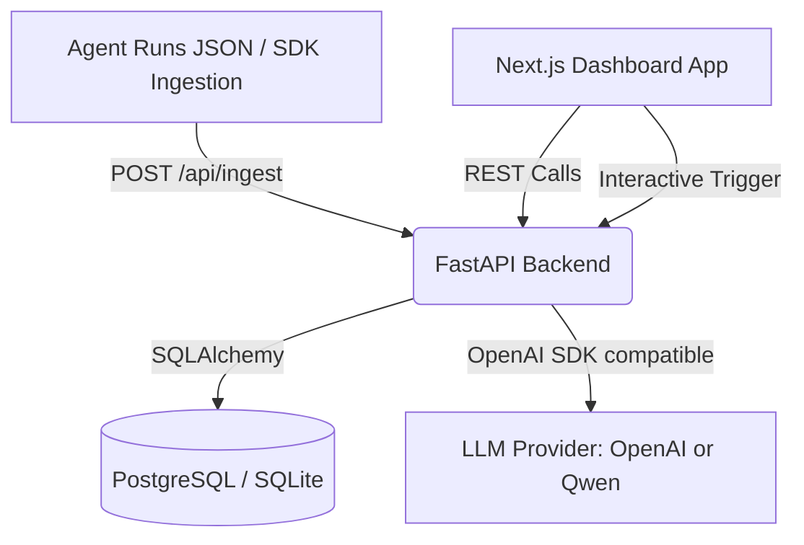

# Sira AI - AI Agent Performance Platform MVP Prototype

This repository contains a fully cohesive MVP prototype for Sira AI's agent observability, comparison, and analysis platform. It implements trace ingestion, an analytics dashboard, regression detection (input-matching hash-based), and LLM failure diagnostic suggestions.

---

## Architecture Overview



---

## Features Implemented

1. **Trace Ingestion Engine**:
   - `POST /api/ingest` resolves relational constraints dynamically: it registers Users, Workspaces, Projects, Agents, and Versions on the fly when parsing new run data.
   - Computes a normalized SHA-256 hash of the input query text to match runs across different agent versions.
   - Records nested execution steps, tool calls, error metrics, and evaluator scores.

2. **Observability Dashboard**:
   - Lists ingested agent runs with filters for Version, Agent, and Success/Failure state.
   - Trace step explorer detailing input/outputs, latency, token count, and nested tool calls (including parameters/returns) for each step.
   - Displays evaluation judge scores and metrics.

3. **Version Comparison Engine**:
   - Matches runs from Version A and Version B based on normalized input text hashes.
   - Computes comparative statistics (success rates, latencies, and costs).
   - Detects **Regressions** (succeeded in baseline, failed in candidate) and **Improvements** (failed in baseline, succeeded in candidate) to help developers gauge performance changes.

4. **LLM Failure Diagnostics**:
   - Interactive single-click failure analysis.
   - Sends the error details, stack trace, and the last executed step details to OpenAI or Qwen API.
   - Summarizes the root cause and outputs an actionable codebase fix suggestion.
   - Automatically falls back to a smart mock diagnostic if no API keys are present.

---

## Database Schema Design

The SQLAlchemy Models map the requested MVP relations:
- `users`: ID, unique email, creation timestamp.
- `workspaces`: Owned by a user.
- `projects`: Belongs to a workspace.
- `agents`: Belongs to a project.
- `versions`: Belongs to an agent (tracks tags like `v1.0.0`, `v1.1.0`).
- `runs`: Stores latency, cost, success state, input, output, and computed `input_hash`.
- `steps`: Individual steps inside a run, with order index.
- `tool_calls`: Tracks nested tool calls, latency, and status.
- `errors`: Stores exception type, messages, and stack trace logs.
- `metrics`: Custom numeric evaluator metrics.
- `evaluations`: Custom text feedback and evaluator scores.
- `failure_analyses`: Saves AI-generated diagnostic summaries and fixes.

---

## Setup & Running Instructions

### Backend (Python FastAPI)

1. Navigate to backend directory:
   ```bash
   cd backend
   ```
2. Create and activate virtual environment:
   ```bash
   python3 -m venv venv
   source venv/bin/activate
   ```
3. Install dependencies:
   ```bash
   pip install -r requirements.txt
   ```
4. Copy the environment template and set your configuration variables:
   ```bash
   cp ../.env.example .env
   ```
   *Note: If you have a Qwen API key, you can configure it inside `.env` using the OpenAI compatibility layer settings.*
5. Run the FastAPI development server:
   ```bash
   uvicorn app.main:app --reload --port 8000
   ```

*Alternatively, start PostgreSQL and Backend together using Docker Compose in the root directory:*
```bash
docker-compose up --build -d
```

### Frontend (Next.js + Tailwind + Bun)

1. Navigate to frontend directory:
   ```bash
   cd frontend
   ```
2. Install dependencies:
   ```bash
   bun install
   ```
3. Run the development server:
   ```bash
   bun run dev
   ```
4. Open [http://localhost:3000](http://localhost:3000) in your browser.

---

## Seeding the Prototype Dashboard

1. Navigate to the **Trace Ingestion** tab in the dashboard.
2. Click **Load Seed dataset (seed_data.json)** to populate the text box with simulated multi-version agent traces.
3. Click **Submit Ingest Traces** to process the seed data.
4. Navigate to the **Runs Explorer** or **Compare Versions** to visualize the ingested traces!
