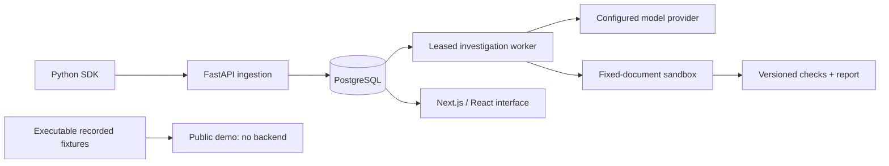

# OMNI

**Understand agent failures. Test better behavior.**

A recruiter-friendly AI reliability prototype by Matías Sepúlveda. Inspect agent traces, distinguish execution success from answer quality, compare versions, and review an evidence-backed repair against a fixed benchmark.

[Try the recorded demo](https://llm-powered-failure-analyzer.vercel.app/demo) · [Engineering case study](docs/CASE_STUDY.md) · [Python SDK](sdk/README.md)

> The public experience contains clearly labeled **simulated traces and recorded test results**, not live LLM calls.

## The three-minute review

1. Open `/demo` and select **Explore the regression**.
2. Inspect `retrieve`: only the overview was returned, omitting the archive policy.
3. Inspect `compose`: the run completed, but its answer invents a 90-day retention period.
4. Open the recorded investigation, follow its evidence links, and review all 20 test results.
5. Export the report or compare `faulty` with `repaired`.

The benchmark records **8/20 → 20/20** passing cases for the scripted reference agent. It tests required facts, known forbidden claims, citations, abstention, and tool behavior. It does not prove general factuality or production safety. Latency in the public dataset is simulated, model calls and spend are zero, and no LLM judge was used.

## Architecture


```mermaid
flowchart LR
  SDK[Python SDK] --> API[FastAPI ingestion]
  API --> DB[(PostgreSQL)]
  DB --> W[Leased investigation worker]
  W --> LLM[Configured model provider]
  W --> S[Fixed-document sandbox]
  S --> R[Versioned checks + report]
  DB --> UI[Next.js / React interface]
  F[Executable recorded fixtures] --> D[Public demo: no backend]
```

- **Frontend:** Next.js, React, TypeScript. Shared view contracts for recorded and live responses.
- **Backend:** FastAPI, SQLAlchemy, Alembic. Legacy ingestion payloads are accepted.
- **Queue:** PostgreSQL jobs with claim locks, leases, fencing tokens, durable checkpoints, bounded attempts and backoff. No in-process FastAPI background task is relied upon.
- **SDK:** Python 3.11+, standard library only. Sync/async contexts, nested spans, bounded export queue and retries, configurable redaction.

## Run the recorded demo

Node 24 and npm:

```sh
cd frontend
npm ci
npm run dev
```

Open `http://localhost:3000/demo`. There is no backend or model-key prerequisite. `/` redirects to `/demo`. Live pages are disabled by default.

## Local live mode

### Docker Compose (recommended)

```sh
# From the repository root. Optionally export OPENAI_API_KEY for investigations.
docker compose up --build -d
# Import recorded traces without presenting them as live model responses.
docker compose cp seed_data.json backend:/tmp/seed_data.json
docker compose exec backend python -m app.seed /tmp/seed_data.json
```

The stack binds API/database ports to localhost. PostgreSQL readiness precedes migrations; API and worker start only after migrations succeed. These local credentials and unauthenticated APIs are for a developer machine, not public hosting.

In `frontend/.env.local`:

```dotenv
ENABLE_LIVE_UI=true
NEXT_PUBLIC_API_URL=http://localhost:8000
```

Start/restart the frontend and open `/live`. To instrument your own agent:

```sh
python -m pip install ./sdk
python scripts/example_agent.py
```

### Without Docker

```sh
python3 -m venv .venv
. .venv/bin/activate
pip install -r backend/requirements-dev.txt ./sdk
cd backend
cp ../.env.example .env
alembic upgrade head
python -m app.seed ../seed_data.json
uvicorn app.main:app --host 127.0.0.1 --port 8000
# Another terminal, from backend with the same environment:
python -m app.worker
```

SQLite supports local exploration and unit tests. Use PostgreSQL for multiple workers; CI separately exercises PostgreSQL concurrent claims.

### Live investigator boundaries

Select a failed execution or a completed run with failed quality checks. The investigator reads the full bounded trace, matching baseline, and evaluation feedback; proposes one candidate; then evaluates that candidate against 20 fixed cases using actual provider responses.

- Provider: `OPENAI_API_KEY`, optional `OPENAI_API_BASE`, `OPENAI_MODEL_NAME`. It must support chat completions with JSON object output. No key or provider error produces an explicit failed job, never a mock success.
- Allowlist: prompt text, retrieval `top_k` 1–3, and 0–1 simulated tool retries. No repository writes, arbitrary Python execution, external tool requests, or production changes.
- Budgets: 180-second wall-clock window, 24 model calls maximum including retries, 1,200 completion tokens per call, 12-second per-call timeout. SDK/provider automatic retries are disabled in the investigator.
- Jobs: up to 3 attempts, exponential delay, 240-second lease, token fencing. Completed case results and spent model calls are persisted. A crashed long-running job can fail its time budget on recovery; it never silently resets its budget.
- Baseline results in the report are explicitly labeled **simulated faulty reference agent**; the candidate is a **live model against fixed sandbox tools**. This is a controlled benchmark, not a claim that a customer's exact agent was replayed.
- Live sandbox execution is supported only for the bundled knowledge-assistant case IDs. Other agents can ingest and inspect traces; their investigations return `unsupported_sandbox` until an executor/evaluation dataset is implemented.
- Model-judged evaluation and model-cost pricing are not implemented. Token usage is recorded; live investigation cost is shown as unavailable.
- Adoption requires developer review. Exported reports include remaining failures and newly introduced regressions.

## APIs and compatibility

- `POST /api/ingest`: existing list-of-runs format, with optional span/parent IDs, timestamps, kind/status, attributes, model, prompt version and case ID. Batch limit 100.
- Exact repeats are accepted without deleting anything. Different payload for an existing ID returns HTTP 409. Legacy records lacking fingerprints are preserved and require a new ID for re-ingestion.
- `GET /api/runs`: pagination, version/agent/execution/search filters, plus aggregate statistics over **all** matching runs.
- `GET /api/runs/{id}`: trace and quality details.
- `GET /api/compare`: pairs stable case IDs (normalized-input fallback for legacy records), chronologically matches repeated observations, and reports unmatched IDs.
- `POST /api/runs/{id}/investigations`: HTTP 202 with a durable job. Repeated submissions return the same job for `investigator/1`.
- `GET /api/investigations/{id}`: queued/running/completed/failed state and report.
- Old `/analyze` route is deprecated and now returns the same asynchronous job contract. The former synchronous summary response has changed.
- `/api/debug` has been removed. All data endpoints require local `LIVE_ENABLED=true`; this flag is an exposure boundary, **not authentication**.

## Data migration

Back up the database first. `alembic upgrade head` adopts the original unversioned schema and adds metadata, benchmark definitions, and investigation jobs without dropping traces or failure analyses. Destructive downgrades are deliberately unavailable.

The old SQLite filename is recognized only in the compatibility helper. If both old and new local databases exist, startup requires an explicit `DATABASE_URL`. To rename safely, stop API/worker, back up with SQLite's backup command, and set `DATABASE_URL` to the verified new copy; do not copy a running WAL database's main file alone. Existing Docker volumes retain their old user/database names: set `DATABASE_URL` and database service credentials to the existing values before upgrading. Do not replace or delete a volume to rebrand it.

## Reproduce and verify

```sh
pip install -r backend/requirements-dev.txt ./sdk
PYTHONPATH=backend:sdk pytest -q backend/tests sdk/tests
python scripts/build_demo.py
cd frontend
npm run lint
npm run typecheck
npm run build
npx playwright install chromium
npm run test:e2e
```

`seed_data.json` and `frontend/src/lib/recorded.json` are generated from the same executable cases. Do not hand-edit them. CI checks regeneration, backend/SDK behavior, migrations, PostgreSQL claim concurrency, frontend checks and browser flows on desktop/mobile.

## Walkthrough recording

With a production preview running on port 3000:

```sh
cd frontend
npm run record
```

The script captures a short silent walkthrough to `public/walkthrough.webm` and a dashboard screenshot under ignored `artifacts/`. The About page links the recording. [Narration/caption script](docs/WALKTHROUGH.md).

## Public deployment

The existing Vercel project can keep its repository Root Directory: the root `vercel.json` preserves its services configuration with **only the frontend service**, rooted at `frontend`. The Python backend is not exposed. For a separate standard Next.js project, set Root Directory to `frontend`; `frontend/vercel.json` installs/builds that app only. Leave `ENABLE_LIVE_UI` disabled. Set `NEXT_PUBLIC_SITE_URL` to the chosen production URL for social previews. No database or provider secret belongs in the public deployment.

After deploying, verify `/demo`, a direct trace URL, `/demo/compare`, `/about`, `/opengraph-image`, and `/walkthrough.webm`; `/live` should be unavailable. Publishing requires access to the existing Vercel project. This follows [Vercel’s monorepo project setup](https://vercel.com/docs/monorepos). See [case study](docs/CASE_STUDY.md) for the validation record and honest limitations.
